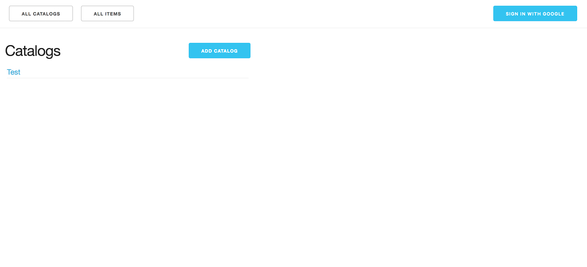

# Item Catalog Project
> Udacity Fullstack Nanodegree Project 5

Project for [Udacity Fullstack Nanodegree](https://www.udacity.com/course/full-stack-web-developer-nanodegree--nd004) that implements a simple catalog and items page. This project is mostly focuses on the backend implementation using the [Flask Framework](http://flask.pocoo.org/) and [SqlAlchemy ORM](https://www.sqlalchemy.org/). It also utilizes [Google's Sign In API](https://developers.google.com/identity/sign-in/web/server-side-flow) on both the backend and the frontend to maximize user security


<p align="center">
	
</p>

## Getting Started
This project uses vagrant to install all dependencies but you have to have virtualbox install to run the vagrant file. After installing vagrant and virtualbox run theses commands inside this directory
```
$ vagrant up
$ vagrant ssh
```
This should install all the dependencies that are necessary and to start the application run these commands
```
$ cd /vagrant/catalog
$ python application.py
```
This should create a new item_catalog file which is a in-memory sqlite database with the correct empty tables. Now you can open your browser at `localhost:8080` and start to populate the database. You must be logged in to create a catalog or a item


### Catalogs Routes
```
/catalogs                     GET
/catalog                      GET
/catalog                      POST
/catalog/<id>/edit            GET
/catalog/<id>/update          POST
/catalog/<id>                 GET
/api/catalogs                 GET
/api/catalog/<id>             GET
```

### Items Routes
```
/items                        GET
/item                         GET
/catalog/<catalog_id>/item    GET
/item                         POST
/item/<id>/edit               GET
/item/<id>/update             POST
/item/<id>                    GET
/item/<id>/delete             GET
/item/<id>/delete             POST
/api/items                    GET
/api/item/<id>                GET
```

### User Routes
These routes are only meant to be called by the google api
```
/google-signin                POST
/logout                       POST
```

## Dependencies
* Vagrant
* Virtualbox
* Python2
