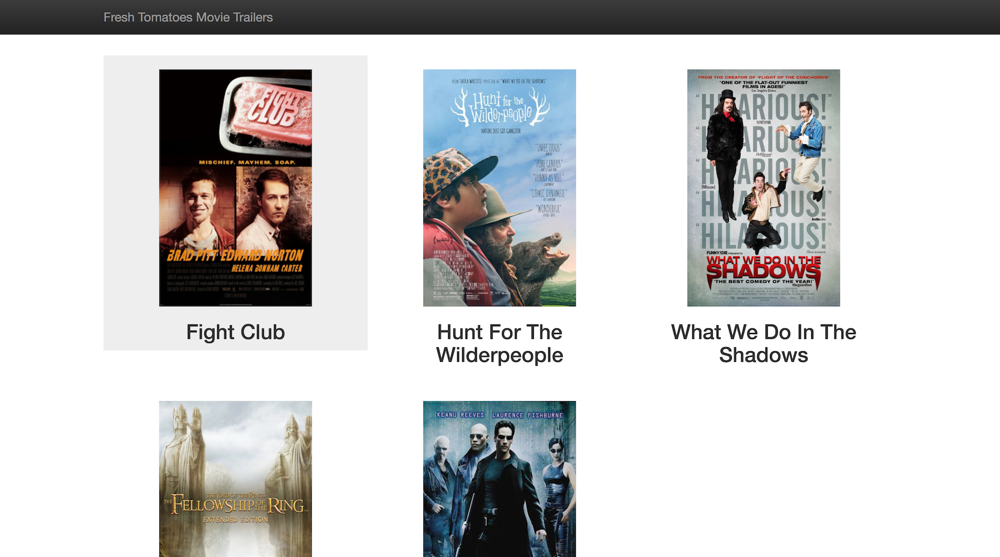

# Movie Trailer Website
> Udacity Fullstack Nanodegree Project 1

This is a simple single-page website that displays my five favorite movies. When the user clicks on one of the film posters an embed Youtube video will pop up to play the movie's trailer.

 

## Development
If you would like to modify the movies that are displayed you can go to the file [movies.json](movies.json) and change the information. Afterward, you can run a single command to render the HTML and open the browser to display your new information.

### Run
This command will rebuild the HTML and open the results in your default browser. Run this command from your terminal window inside the projects root directory.

``$ python entertainment_center.py``

### Dependencies

* Python 2.7
