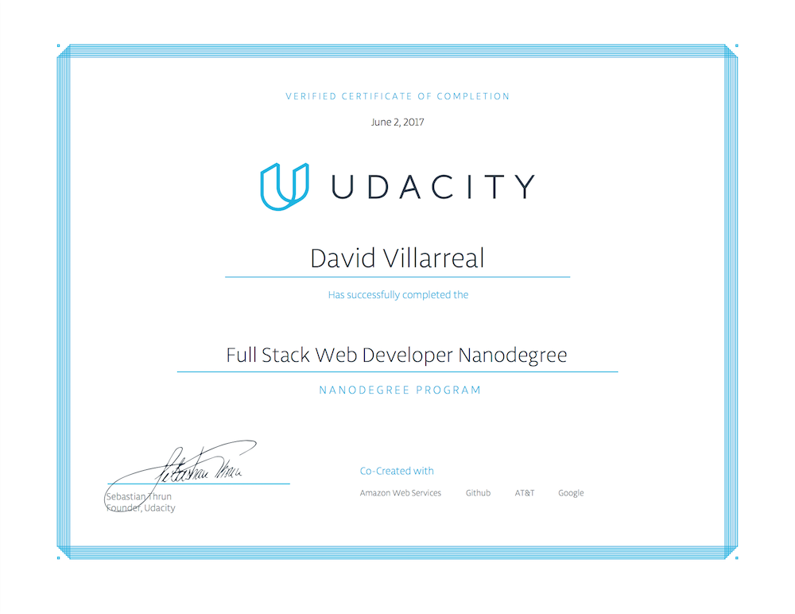

# Udacity Fullstack Nanodegree Projects
These are the projects that I completed for the [Udacity Fullstack Nanodegree](https://www.udacity.com/course/full-stack-web-developer-nanodegree--nd004).

### Projects

1. [MovieTrailerWebsite](MovieTrailerWebsite/)
2. [Portfolio Site](https://github.com/Phaze1D/Portfolio)
3. **[Multi User Blog](https://github.com/Phaze1D/Blug)**
4. [Tournament Database](TournamentProject/)
5. [Build an Item Catalog](ItemCatalog/)
6. **[Neighborhood Map](https://github.com/Phaze1D/Google_Zomato_Maps)**
7. [Linux Server Configuration](LinuxConfigProject/)

### Certificate of Completion

#### Dates
* February 15, 2017 - April 28, 2017
* *(Paused do to work)*
* May 28, 2017 - June 2, 2017
